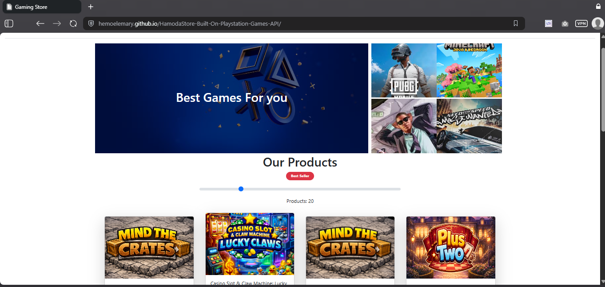

# HamodaStore-Built-On-Playstation-Games-API
USED HTML CSS JS BOOTSTRAP , APIS&amp;GRID&amp;FLEX&amp;JS EVENTS&amp;RANGE 
you can:
<ul>
  <li>Search about any game on playstation store</li>
  <li>Range from 0 to 100 number of games</li>
  <li>Make dark mode</li>
  <li>when mouse enter button appear on cards and text appear on grid cols like the pictures</li>
</ul>

<a href='https://hemoelemary.github.io/HamodaStore-Built-On-Playstation-Games-API/'>try now</a>
